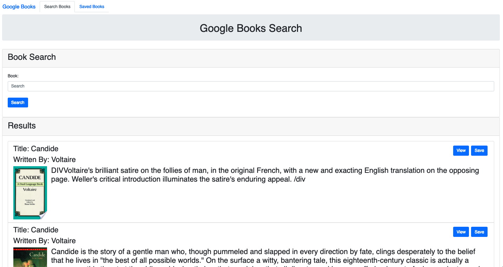
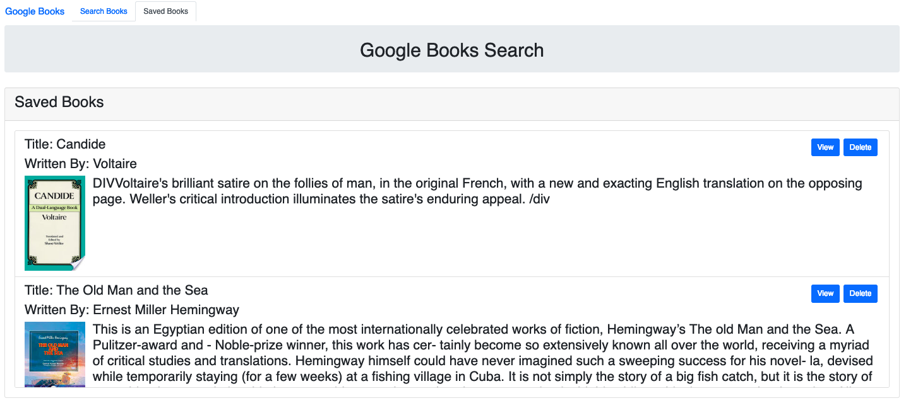

# Live Link to [Google Books Search](https://bcbc-nyt-gbooks-search.herokuapp.com/)
### 1. Why / Background
  * Google Books Search is a web based application enabling users to search Google Books, view and save for later viewing.
 ### 2. What / Objectives / User Stories
  * From design through deployment of the application, this project used the following web development technologies:
    * Server-side: Node.js w/ Express web app framework; MongoDB for data persistence w/ Mongoose ORM 
    * Client-side: React.js library for component based user interface; Bootstrap framework for HTML/CSS
  * User Stories, by categorization:
    * Design and develop Wireframe mockup including conceptual single page application with component based views: search books, saved books
    * Design and develop Model schema including ORM (Mongoose) and DB (MongoDB) configuration
    * Design and develop View on UI including components (React)
    * Design and develop Controller functions including routing and required CRUD operations
 ### 3. How / Design Description
  * Although scope of the project fits well into [Agile methodology with Scrum and Kanban frameworks](https://en.wikipedia.org/wiki/Agile_software_development), due to limited scope and non-group assignment, GitHub's built-in tools were not used to support project execution:
    * Projects: Kanban board for documenting user stories and overall progress
    * Issues: Issue tracking for user stories, features and bug report
  * Functionality - refer to [video of application user flow](https://drive.google.com/open?id=1LxEJ5n43CZ9n3uTPQSeTGITy0VCj0IjR)
    * Wireframe
      * Search Books 
      * Saved Books 
      * Sign up as a new user 
      * JSON Resources
        * Articles 
  * Design Description
    * Application Setup (server.js)
      * Configure Express web app framework listening on process.env.PORT for Heroku deployment or default to 3001 for localhost. Serve up static assets. Configure middleware including Morgan Logger and parse URL encoded (any type including nested objects, JSON). Setup routes. Connect Mongoose models.
      * Required modules: npm (express, path, morgan, mongoose), /routes
      * Relevant functions: require(), use(), connect(), listen()
      * Export: N/A
    * Database Setup N/A
    * Configuration Definition N/A
    * Model Setup (/models, index.js)
      * Define Mongoose model for Book object.
      * Required modules: npm (mongoose)
      * Relevant functions: require(), model(), exports()
      * Export: Book
    * Controller Setup (index.js, books.js, booksController.js)
      * Assign routing views <-> model <-> DB as HTTP methods <-> CRUD operations <-> MongoDB
        * POST <-> Create <-> INSERT
        * GET <-> Read <-> FIND
        * PUT <-> Update <-> UPDATE
        * DELETE <-> Delete <-> DELETE
      * Required modules: npm (path, express), books.js, /api, booksController, /models
      * Relevant functions: require(), use(), sendFile(), exports(), route(), sendFile(), join(), get(), findAll(), findById(), post(), create(), delete(), remove(), then(), catch()
      * Export: router, findAll, findById, create, update, remove
    * Authentication Setup N/A
    * View Setup (/client, /public, /src)
      * Configure React library for single page application leveraging the following reusable components:
        * /components
          * /Button
          * /Card
          * /Form
          * /Grid
          * /Jumbotron
          * /List
          * /Nav
        * /pages
          * SavedBooks
          * SearchBooks
          * NoMatch
  * Prerequisites for Development:
    * MacBook Air (Intel Core i7, 2.2 GHz, 1 Processor, 2 Cores, 8GB)
    * 64 bit operating system 
    * git version 2.18.0
    * Visual Studio Code Version 1.29.1
    * [GitHub Project-3](https://github.com/OrionAbrams/Project-3)
    * Chrome Version 70.0.3538.110 (Official Build) (64-bit)
  * Built With:
    * This app was bootstrapped with [Create React App](https://github.com/facebook/create-react-app).
    * Client-side:
      * HTML/CSS/JS
      * [Bootstrap](https://getbootstrap.com/docs/4.2/getting-started/introduction/)
    * Server-side:
      * [Node.js](https://nodejs.org/docs/latest/api/documentation.html)
        * [npm](https://www.npmjs.com/)
          * Server-side:
            * [express](https://www.npmjs.com/package/express)
            * [if-env](https://www.npmjs.com/package/if-env)
            * [mongoose](https://www.npmjs.com/package/mongoose)
            * [morgan](https://www.npmjs.com/package/morgan)
            * [path](https://www.npmjs.com/package/path)
          * Client-side:
            * [axios](https://www.npmjs.com/package/axios)
            * [react](https://www.npmjs.com/package/react)
            * [react-dom](https://www.npmjs.com/package/react-dom)
            * [react-router-dom](https://www.npmjs.com/package/react-router-dom)
            * [react-scripts](https://www.npmjs.com/package/react-scripts)
          
    * Cloud:
      * [Heroku](https://devcenter.heroku.com/articles/getting-started-with-nodejs) with [mLab MongoDB plugin](https://devcenter.heroku.com/articles/mongolab)
  * Installing:
    * For further development or use of this application, clone or download application files from GitHub, which is organized into the following directory structure:
      * /nyt-gbooks-search (application root directory level for Node/Express server)
        * /client (React app specific directories)
          * /node_modules (ignored by git) - generated first time npm install executes
          * /public
            * /readmelinks
          * /src
            * /components
            * /pages
          * /utils
          * .env (ignored by git) - environmental variables with REACT_APP_ prefix
          * package-lock.json
          * package.json - includes scripts, dependencies, devDependencies
          * README.md
          * yarn.lock
        * /controllers
        * /models
        * /node_modules (ignored by git) - generated first time npm install executes
        * /routes
          * /api
        * .env (ignored by git) - environmental variables for Node/Express server
        * .gitignore
        * LICENSE
        * package.json - includes scripts, dependencies, devDependencies
        * README.md
        * server.js
        * yarn.lock
    * After obtaining Google Books API, configure per the following:
      * Development environment for localhost requires creating .env file in /client directory with the following
        * REACT_APP_GBOOKS_API=Your API Key Here
      * Production environment for Heroku deployment requires setting Config Vars with the following within Heroku app Settings menu:
        * KEY
          * REACT_APP_GBOOKS_API
        * VALUE
          * Your API Key Here
    * Once the application files are ready per the above structure, go to the application root directory level and enter the following in terminal:
      * yarn install
        * Installs required node packages, referring to the included dependencies in respective package.json files and creates required node packages in /node_modules and creates or updates the respective package-lock.json, yarn.lock files.
      * yarn start
        * Runs the app in development mode at http://localhost:3000 (React) and http://localhost:3001 (Node/Express).
  * Running the tests:
    * Unit testing was informally executed
  * Deployment:
    * App deployed on [Heroku](https://bcbc-nyt-gbooks-search.herokuapp.com/)
 ## Versioning
  * For the versions available, see the tags on this repository.
 ## Authors
  * John Kawahara.
  * N/A- See also the list of contributors who participated in this project.
 ## License
  * This project is licensed under the [MIT License](LICENSE).
 ## Acknowledgments
  * Thanks to David Hallinan, Hannah Bowers and Glo Austin for their guidance and support.
